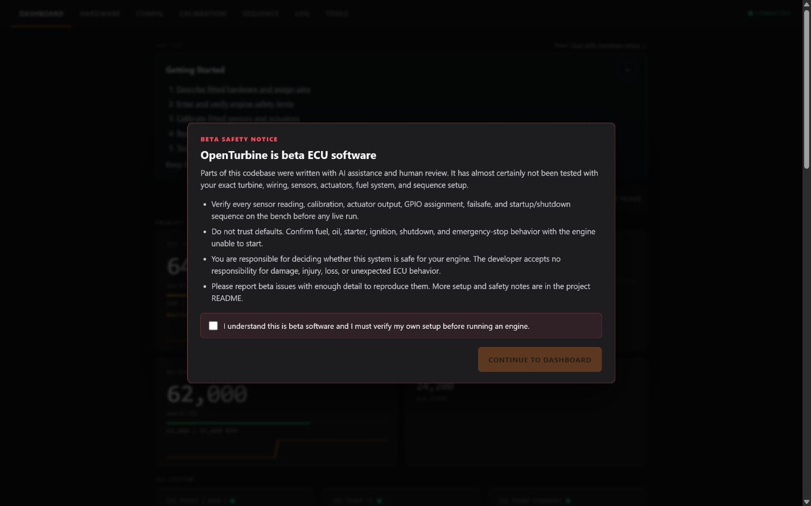

  

  Open-source turbine ECU software for supported ESP32 boards, with guided Windows setup and a browser-based dashboard.

  <a href="https://github.com/elia179/OpenTurbine/releases/latest/download/OpenTurbineSetupTool.exe"><strong>Download for Windows</strong></a>
  · <a href="https://elia179.github.io/OpenTurbine/get-started/">Get started</a>
  · <a href="https://elia179.github.io/OpenTurbine/hardware/">Hardware guide</a>
  · <a href="docs/README.md">Developer documentation</a>

## What is OpenTurbine?

OpenTurbine is experimental open-source turbine engine controller software for turbojets, APUs, generators, turboshafts, turboprops, and other small turbine systems. It runs on a supported ESP32 board and provides configurable startup and shutdown sequences, fuel and oil control, monitoring, fault handling, calibration, logging, and a browser-based interface.

The normal Windows installation does not require Git, PlatformIO, or source-code compilation.

## What you need

- A Windows computer and data-capable USB cable
- A supported ESP32 board
- A browser-capable phone or computer for the dashboard
- Suitable driver electronics, sensors, power protection, and fusing
- A verified independent physical fuel/power stop and restrained test equipment

## Start with a new board

1. Connect a supported ESP32 board using a USB data cable.
2. [Download OpenTurbine Setup Tool](https://github.com/elia179/OpenTurbine/releases/latest/download/OpenTurbineSetupTool.exe).
3. Choose **Clean install / reinstall** for a blank board, or **Update and keep my setup** for a working controller.
4. Follow the Setup Tool, then join the board Wi-Fi and open the address it shows (normally `http://192.168.4.1`).

The stable release asset was verified for [Setup Tool v0.5.23](https://github.com/elia179/OpenTurbine/releases/tag/setup-tool-v0.5.23). It is currently unsigned; only continue through Windows warnings after confirming it came from this official release.

## Supported targets

| Target | Status |
| --- | --- |
| Classic ESP32 with at least 4 MB flash | Supported |
| ESP32-S3 DevKitC-1 N16R8 target | Supported |
| Windows guided setup | Supported |
| macOS/Linux graphical installer | Not currently available |
| Manual source build | Advanced/developer path |
| Certified aviation use | Not certified |

> **Experimental engine-control software:** Verify all limits, outputs, shutdown paths, and sequences on a restrained test setup. Use an independent physical fuel/power stop. OpenTurbine does not make an engine safe or replace suitable drivers, fusing, sensors, or operating judgment.

## Before introducing fuel

Configure only the hardware you actually fitted, then verify inputs, limits, calibration, sequences, and individual outputs with fuel and ignition made safe. Run complete dry sequences and verify every stop path before planning a controlled fueled test.

## Documentation

- [Public landing site](https://elia179.github.io/OpenTurbine/)
- [Get started](https://elia179.github.io/OpenTurbine/get-started/)
- [Hardware guide](https://elia179.github.io/OpenTurbine/hardware/)
- [User guide](docs/USER_GUIDE.md)
- [Troubleshooting](https://elia179.github.io/OpenTurbine/troubleshooting/)
- [Safety](https://elia179.github.io/OpenTurbine/safety/)
- [Developer documentation](docs/README.md)

## Help and status

Use [Setup Help](https://github.com/elia179/OpenTurbine/issues/new?template=setup_help.yml) for Windows, installation, USB, Wi-Fi, and dashboard issues. Use [Bug reports](https://github.com/elia179/OpenTurbine/issues/new?template=bug_report.yml) only for reproducible software behavior, and [Discussions](https://github.com/elia179/OpenTurbine/discussions) for hardware and wiring questions.

OpenTurbine is experimental, not a certified engine-control system. Contributions are welcome; read the developer documentation before building source. Released under the [MIT License](LICENSE).
